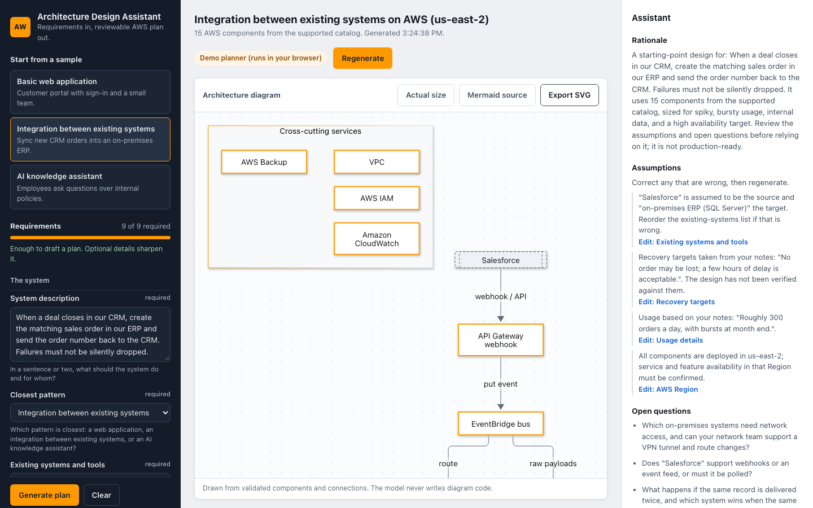

# AWS Architecture Design Assistant (MVP)

A local workbench for people who understand their business problem but not AWS. You describe the system you need, the assistant checks whether it has enough information, asks focused follow-up questions if it does not, and then produces a **reviewable** AWS architecture plan with a diagram.

> This is a planning aid. It never creates AWS resources, never asks for AWS credentials, and its plans are **not production-ready**. Treat every plan as a starting point for review.



## What it does

1. **Requirements discovery.** The left panel captures the purpose, existing systems, expected usage, data sensitivity, AWS Region, availability and recovery needs, budget posture, and operational constraints. A completeness meter shows what is still missing.
2. **Follow-up questions before design.** If a required answer is missing, the assistant returns questions (with the reason each one matters) instead of guessing an architecture.
3. **A structured plan.** Once requirements are complete, the plan includes:
   - an architecture diagram, exportable as SVG
   - the selected AWS components and what each one does in this design
   - a step-by-step data-flow explanation
   - assumptions (each linked to the requirement you can edit to correct it) and open questions
   - security, reliability, performance, operations, and cost considerations
   - at least one alternative with its tradeoffs
   - a high-level implementation sequence
4. **Edit and regenerate.** Change any requirement; the plan is marked stale until you regenerate, and the result visibly changes (for example, switching to "team already uses containers" turns a serverless design into ALB + ECS Fargate + RDS).

Three one-click samples are included: a basic web application, an integration between existing systems (CRM to on-premises ERP), and an AI knowledge assistant.

## How it stays honest

| Rule | How it is enforced |
| --- | --- |
| The model returns structured data, not diagrams | Providers return JSON validated by a Zod schema (`shared/schema.ts`). Mermaid is generated by the app from validated nodes and connections (`shared/mermaid.ts`), with labels reduced to a safe character set. |
| Only supported AWS components | `shared/catalog.ts` lists 41 supported services. Components outside it are removed from the diagram, reported as validation warnings, and flagged as a caution (`shared/validate.ts`). |
| Invalid diagram data is rejected | Duplicate ids, connections to undeclared nodes, self-loops, unsafe ids, or free-form text instead of structured data produce an error and no diagram. |
| No fabricated citations | `shared/sources.ts` is a typed registry of 56 official AWS documentation pages (AWS Well-Architected Framework, its pillars and lenses, two whitepapers, cost tooling docs, and service overview pages). Each URL was fetched and confirmed (HTTP 200, matching page title) on 2026-10-01. Plans cite registry ids only; unknown ids are stripped, and a claim left with no source is relabelled as an **assumption**. |
| No confident answers it cannot back up | Requests for exact costs, compliance certification, "production-ready" or guaranteed uptime, and other clouds produce explicit cautions instead of answers (`shared/guardrails.ts`). |
| No invented prices | Cost is described as drivers and relative tradeoffs, with links to AWS Pricing Calculator and AWS Budgets documentation for building a real estimate. Tests assert no dollar figures appear. |

## Setup and running

Requirements: Node.js 20.19+ or 22.12+ (developed on Node 25) and npm.

```bash
cd ~/Projects/aws-architecture-assistant
npm install
npm run dev          # API on http://localhost:4080, web on http://localhost:5180
```

Open http://localhost:5180. No credentials or `.env` file are needed; the app starts in **demo mode**.

Run the pieces separately if you prefer:

```bash
npm run dev:api      # Express API (tsx watch) on port 4080
npm run dev:web      # Vite dev server on port 5180, proxies /api to 4080
```

Ports can be changed with `API_PORT` and `WEB_PORT` (both read by the API and by `vite.config.ts`). The web server uses `strictPort`, so it fails instead of silently moving to another port.

Production build of the front end: `npm run build` (output in repo-root `dist/`). The built site runs the demo planner in the browser and needs no API (see [Deployment](#deployment-static-site-demo-planner-in-the-browser)).

### Which planner runs

The UI shows a badge with the planner that produced the plan on screen: **Demo planner (runs in your browser)** or **Server API (provider: demo / anthropic)**.

| `VITE_PLANNER` | Where | Behaviour |
| --- | --- | --- |
| unset (default) | production build (`npm run build`) | In-browser demo planner. No `/api` requests are made. |
| unset (default) | dev server (`npm run dev`) | Probes `/api/health`; uses the API if it answers, otherwise falls back to the in-browser demo planner. |
| `local` | anywhere | Always the in-browser demo planner. |
| `api` | anywhere | Always the server API. If it cannot be reached, the UI says so and offers a one-click switch to the in-browser demo planner; it never swaps silently. |

The in-browser planner runs exactly the same code path as `POST /api/plan` (`planFromInput` in `shared/service.ts`: schema check, completeness gate, guardrails, `DemoProvider`, validation, Mermaid). Tests assert both paths return identical results for the three samples.

To use `npm run preview` against the API, build with `VITE_PLANNER=api npm run build`.

## Deployment (static site, demo planner in the browser)

The public demo is a static Vite build hosted on Vercel; pushes to `main` auto-deploy. There is no server on Vercel: no `api/` directory and no serverless functions. All planning in the deployed site happens in the browser with the deterministic demo planner, the bundled catalog, the sources registry, and the sample scenarios.

Vercel settings (the auto-detected **Vite** preset works as-is, so there is no `vercel.json`):

- Build command: `npm run build` (runs `vite build`)
- Output directory: `dist` (Vite's root is `web/`, but `outDir: '../dist'` writes to the repo-root `dist/`, which is the preset's default)
- Install command: `npm install`
- No environment variables. Leave `VITE_PLANNER` unset (or set it to `local`). Never set `VITE_PLANNER=api` there, and never add `ANTHROPIC_API_KEY`: the static site has no server to use it.
- No SPA rewrites are needed: the app is a single page with no client-side routes.

The optional live Anthropic provider is **server-only** and is available only when you run the API locally (`npm run dev` with `MODEL_PROVIDER=anthropic` and `ANTHROPIC_API_KEY` in `.env`). The client bundle never includes the Anthropic SDK or reads that key; `tests/bundle.test.ts` builds the bundle and fails if it does.

To check a production build the way Vercel serves it (no `/api`):

```bash
npm run build
cd dist && python3 -m http.server 4321      # any plain static server works
# in another terminal:
E2E_URL=http://localhost:4321/ E2E_EXPECT_PLANNER=local npm run e2e
```

## Tests

```bash
npm run typecheck    # tsc --noEmit over shared, server, web, and tests
npm test             # vitest: 89 unit, API, client-planner, and bundle tests; no network access, no model calls
npm run e2e          # browser checks + screenshots against a running instance (dev server or static build)
```

`npm test` covers:

- **Incomplete requirements:** empty or partial input returns follow-up questions and no plan; integrations require existing systems; an unmatched workload type asks instead of guessing.
- **Unsupported service suggestions:** services outside the catalog are removed, flagged, and never reach the diagram.
- **Invalid diagram data:** dangling connections, duplicate ids, self-loops, unsafe ids, missing sections, and free-form diagram text are rejected (also through the HTTP API, which returns 422).
- **Questions it should not answer confidently:** cost, compliance, production readiness, other clouds, regulated data, and mission-critical availability produce cautions; plans contain no dollar figures and never claim to be production-ready.
- **Citations:** every source id cited by every demo plan, across all 1,728 combinations of the main requirement options, exists in the curated registry; all registry URLs are official `docs.aws.amazon.com` pages.
- **Diagrams render:** generated Mermaid for every sample parses with Mermaid itself (jsdom), including labels containing hostile text.
- **Determinism and editability:** the same input always produces the same plan, and changing operations, sensitivity, availability, Region, existing systems, or document type changes the plan.
- **Client/server parity:** the in-browser planner returns the same validated plan as `POST /api/plan` for all three samples, and the same questions and schema errors for incomplete or malformed input. Planner mode selection is covered for every `VITE_PLANNER` / dev / production combination.
- **No secrets in the bundle:** a real `vite build` is checked for the Anthropic SDK, `ANTHROPIC_API_KEY`, the Anthropic API host, and the live provider's prompt.

`npm run e2e` (`scripts/e2e-screenshots.mjs`) drives Chromium through `playwright-core` against a running instance (`E2E_URL`, default the dev server). With `E2E_EXPECT_PLANNER=local` it also asserts the planner badge and that no `/api` request is made. It loads each sample, edits requirements and regenerates, exports the SVG, checks the follow-up-question path and guardrails, checks for horizontal overflow at 1440, 1024, and 390 px, fails on console errors, and writes screenshots to `docs/screenshots/`. It uses a locally installed Playwright Chromium build (revision 1243, matching `playwright-core@1.63.0`); run `npx playwright@1.63.0 install chromium` if you do not have one.

## Optional live provider (off by default)

The model provider sits behind a small interface (`shared/provider.ts`). Demo mode uses `DemoProvider`, a deterministic rules-and-templates engine. An optional Anthropic Claude provider exists in `server/providers/anthropic.ts`:

- It runs only on the server. The browser never sees a key, and it is not part of the deployed static site.
- It is used only when **both** `MODEL_PROVIDER=anthropic` and `ANTHROPIC_API_KEY` are set in the API server's environment (or in a local `.env`, which is git-ignored). Otherwise the server logs a note and stays in demo mode.
- It requests structured output matching the same Zod schema, and its output goes through the same validation, catalog check, citation check, and guardrails as demo output.
- It has **not** been exercised against the live API in this MVP, and tests never call it. Using it costs money on your Anthropic account.

```bash
cp .env.example .env    # then set MODEL_PROVIDER=anthropic and ANTHROPIC_API_KEY=...
```

## Supported scope

- AWS only, single-Region designs (Multi-AZ where availability calls for it).
- Three reviewed demo patterns: web application, integration between existing systems, AI knowledge assistant.
- 41 catalog services across edge, compute, data, integration, AI, security, operations, and networking.
- Requirement options: 14 commercial Regions; usage low, moderate, high, spiky; sensitivity public, internal, confidential, regulated; availability best effort, business hours, high, mission critical; budget minimal, moderate, flexible; operations small team, ops team, containers.

## Limitations

- **Not production-ready.** Plans are starting points. Validate them with your team and a Well-Architected review.
- **No cost estimates.** Only cost drivers and relative tradeoffs. Use AWS Pricing Calculator with your own numbers.
- **No compliance determination.** Regulated data and compliance keywords produce cautions, not answers.
- **No disaster-recovery design.** Mission-critical workloads are flagged; multi-Region DR is out of scope.
- **Demo mode is template-based.** It recognises a few keywords in free text (on-premises, SFTP/CSV, schedules, workflows, scanned documents, common SaaS names) and otherwise relies on the structured answers. Anything outside the three patterns gets a question rather than a design.
- **Region and model availability are not checked.** The plan states the assumption and asks you to confirm service and Amazon Bedrock model availability in your Region.
- **Citations point to overview pages.** Sources support the general practice cited, not every detail of your specific design.
- **Source links can change.** URLs were verified on 2026-10-01; AWS may move pages later.
- **Diagram layout is automatic.** Large plans can be tall; use "Actual size" and scroll, or export the SVG.
- **No persistence or auth.** Requirements live in the browser tab; refresh clears them.
- **The deployed site is demo-only.** The public Vercel site runs only the rules-based demo planner in your browser. The live Claude provider needs the local server and your own API key; it is not hosted.
- **Large client bundle.** Mermaid ships to the browser; its diagram types are split into chunks that load on demand, so the first visit downloads more JavaScript than the app itself needs.

## Project layout

```
shared/            Logic shared by API, UI, and tests (browser-safe: no Node-only imports)
  schema.ts        Zod schemas for requirements, plans, and API responses
  catalog.ts       Supported AWS component catalog
  sources.ts       Curated, verified official AWS source registry
  requirements.ts  Completeness rules and follow-up questions
  guardrails.ts    Topics answered with cautions instead of confidence
  provider.ts      Provider interface
  demoProvider.ts  Deterministic demo provider (templates + rules)
  validate.ts      Plan validation: schema, diagram integrity, catalog, citations
  mermaid.ts       Mermaid generation from validated data, with label sanitizing
  service.ts       Pipeline: schema check -> completeness -> guardrails -> provider -> validation -> Mermaid
  scenarios.ts     The three sample scenarios
server/            Express API (port 4080) and optional Anthropic provider
web/               React + Vite workbench (port 5180); src/planner.ts picks in-browser vs API planner
tests/             Vitest unit and API tests
scripts/           Browser e2e + screenshot script
docs/screenshots/  Screenshots captured by `npm run e2e`
```
