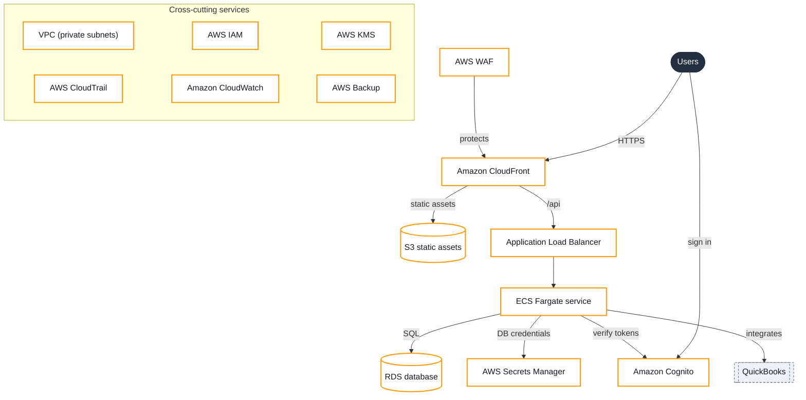

# Web application on AWS (us-east-1)

Generated 2026-10-02T00:05:02.902Z by the AWS Architecture Design Assistant (planner: demo).

> **Not production-ready.** This document is a reviewable starting point generated from the stated requirements. It is not production-ready, does not establish compliance, and contains no cost figures. Validate it with your team and a Well-Architected review before building.

## Summary

A starting-point design for: A customer portal where our clients sign in to view their orders, download invoices, and update their contact details. It uses 14 components from the supported catalog, sized for moderate usage, confidential data, and a high availability target. Review the assumptions and open questions before relying on it; it is not production-ready.

## Requirements as entered

- **What should the system do?** A customer portal where our clients sign in to view their orders, download invoices, and update their contact details.
- **What kind of system is it? (closest pattern)** A website or web app
- **Which existing systems does it connect to?** QuickBooks
- **How busy will it be? (expected usage)** Moderate
- **Any numbers you know?** About 2,000 registered customers; a few hundred active per day.
- **How sensitive is the data?** Confidential: customer or business data
- **Where are most of your users? (AWS Region)** US East (N. Virginia) · us-east-1
- **How much downtime is acceptable? (availability and recovery)** Almost always up (high availability)
- **After a serious failure, how much data could you lose, and for how long could it be down? (RPO and RTO)** _Not answered_
- **How should cost be balanced against other goals? (budget)** Keep costs as low as possible
- **Who will look after it day to day? (operations)** We already use containers (Docker etc.)
- **Anything else we should know?** Two developers, comfortable with TypeScript, no dedicated ops staff.

## Architecture diagram

Generated from the validated components and connections below.

## Components

- **Users** (People): People using the web application in a browser.
- **Amazon CloudFront** (Edge): Serves the front end over HTTPS from edge locations and forwards API calls to the backend. (sources: [1])
- **S3 static assets** (Data, Amazon S3): Private bucket holding the built front-end assets, readable only through CloudFront. (sources: [2])
- **AWS WAF** (Security): Filters malicious or abusive requests before they reach the application. (sources: [3])
- **Amazon Cognito** (Security): User sign-up and sign-in; issues tokens the API verifies on every request. (sources: [4])
- **Application Load Balancer** (Application): Spreads API traffic across containers running in more than one Availability Zone. (sources: [5])
- **ECS Fargate service** (Application, Amazon ECS on AWS Fargate): Runs the backend API as containers without managing servers. (sources: [6])
- **RDS database** (Data, Amazon RDS): Relational database for application data. (sources: [7])
- **AWS Secrets Manager** (Security): Holds and rotates the database credentials used by the containers. (sources: [8])
- **VPC (private subnets)** (Security, Amazon VPC): Private subnets for containers and database across at least two Availability Zones. (sources: [9])
- **QuickBooks** (Existing system): Existing system the application exchanges data with.
- **AWS IAM** (Security): Least-privilege roles for every compute component; no long-lived access keys in code. (sources: [10])
- **AWS KMS** (Security): Customer managed keys for encrypting stored data and controlling who can decrypt it. (sources: [11])
- **AWS CloudTrail** (Operations): Audit trail of account activity and API calls. (sources: [12])
- **Amazon CloudWatch** (Operations): Metrics, logs, dashboards, and alarms for every component. (sources: [13])
- **AWS Backup** (Operations): Policy-based backups of stateful data stores. (sources: [14])

## Data flow

1. The user loads the front end from CloudFront, which reads the built assets from a private S3 bucket.
2. The user signs in with Amazon Cognito and receives a token.
3. API calls go through CloudFront to the Application Load Balancer, which routes them to ECS tasks in private subnets.
4. The containers read and write application data in the relational database, using credentials fetched from Secrets Manager.
5. Logs and metrics from every component flow to CloudWatch for dashboards and alarms.

## Assumptions

- Users need to sign in because the data is not public. _Change this in: Data sensitivity._
- No recovery targets given (how much data you could lose and how long you could be down, known as RPO and RTO). Assumed that surviving the loss of one data center (Multi-AZ, within one Region) plus backups is acceptable. _Change this in: Recovery targets._
- Usage based on your notes: "About 2,000 registered customers; a few hundred active per day.". _Change this in: Usage numbers._
- All components are deployed in us-east-1; service and feature availability in that Region must be confirmed. _Change this in: User location._
- Constraint noted: "Two developers, comfortable with TypeScript, no dedicated ops staff.". _Change this in: Other constraints._

## Open questions

- How should the app connect to QuickBooks: public API, private network, or file exchange?
- After a serious failure, how much recent data could you afford to lose, and how long could the system be down? These recovery targets (the recovery point objective, RPO, and recovery time objective, RTO) decide the disaster-recovery strategy.
- Do you need a custom domain? If so, plan DNS (Route 53 or your current provider) and a TLS certificate.

## Considerations by pillar

### Security

- Attach AWS WAF rules to the CloudFront distribution to filter common web exploits and rate-limit abusive clients. (sources: [3], [15])
- Use a managed identity service such as Amazon Cognito rather than building password storage and sign-in yourself. (sources: [4], [15])
- Place the containers and database in private subnets and allow database access only from the application security group. (sources: [9])
- Keep database credentials in Secrets Manager rather than in code or environment files. (sources: [8])
- Give each function or service its own IAM role scoped to only the actions and resources it needs. (sources: [10], [15])
- Encrypt data at rest with AWS KMS keys and restrict key usage through key policies. (sources: [11], [15])
- Enable CloudTrail so that access to sensitive resources can be audited. (sources: [12])

### Reliability

- Run tasks in at least two Availability Zones behind the load balancer so a single-AZ failure does not take the service down. (sources: [5], [16])
- Use a Multi-AZ deployment for the RDS database so a standby can take over if the primary fails. (sources: [7], [17])
- Use AWS Backup with a defined schedule and retention, and test restores rather than assuming they work. (sources: [14], [17])
- Choose a disaster-recovery strategy (backup and restore, pilot light, warm standby, or multi-site) from agreed recovery targets: how much data you can afford to lose (RPO) and how long you can be down (RTO). (sources: [18])

### Performance efficiency

- Configure ECS Service Auto Scaling on CPU or request count so capacity follows demand. (sources: [6], [19])
- Cache static assets at the edge with CloudFront to reduce latency for distant users and load on the origin. (sources: [1], [19])

### Operational excellence

- Send logs and metrics to CloudWatch and alarm on error rates and latency, not only on infrastructure health. (sources: [13], [20])
- Define the infrastructure as code (for example CloudFormation) so environments are reproducible and changes are reviewable. (sources: [21], [20])

### Cost (drivers, not estimates)

- **Assumption:** Cost drivers: the load balancer, running container tasks, and the database instance are billed while running, even when idle. Data transfer out and NAT gateways are common surprises.
- Treat cost as a design input: estimate from your own usage numbers with AWS Pricing Calculator and set AWS Budgets alerts before launch. (sources: [22], [23], [24])
- **Assumption:** Minimal budget: the plan favours services that scale down when idle. Always-on resources (load balancers, provisioned databases, NAT gateways) are the main things to avoid or justify.

## Alternatives and tradeoffs

### Serverless API (API Gateway + Lambda + DynamoDB)

Replace the load balancer, containers, and relational database with a managed API, functions, and a serverless database. (sources: [25], [26], [27], [28])

Gains:

- Scales to zero when idle, so low or spiky usage costs less.
- No containers or database instances to patch or size.

Costs:

- Requires designing data access around DynamoDB keys instead of SQL joins.
- Per-request pricing can cost more than containers at sustained high volume.
- Function cold starts may add latency to some requests.

### AWS Amplify Hosting for the front end

Use Amplify Hosting for build, deploy, and hosting of the front end instead of wiring S3 and CloudFront yourself. (sources: [29])

Gains:

- Built-in CI/CD from a Git repository and preview environments.
- Less configuration for a small team.

Costs:

- Less fine-grained control over caching and edge behaviour.
- Another service and deployment model to learn.

## Implementation sequence

1. Set up an AWS account (ideally with separate dev and prod accounts) in us-east-1, with billing alerts and IAM roles for the team.
2. Define the infrastructure as code: networking, storage, and the data store.
3. Containerise the backend, push images to a registry, and deploy the ECS service behind the load balancer.
4. Host the front end in a private S3 bucket behind CloudFront.
5. Add Amazon Cognito sign-in and require tokens on every API route.
6. Add CloudWatch dashboards and alarms, then load-test against your expected usage.
7. Run a Well-Architected review of the result before launch.

This assistant never creates AWS resources. These steps are for your team to plan and review.

## Cautions

_None flagged._

## Sources

1. [What is Amazon CloudFront?](https://docs.aws.amazon.com/AmazonCloudFront/latest/DeveloperGuide/Introduction.html)
2. [What is Amazon S3?](https://docs.aws.amazon.com/AmazonS3/latest/userguide/Welcome.html)
3. [AWS WAF, AWS Firewall Manager, AWS Shield Advanced, and AWS Shield network security director](https://docs.aws.amazon.com/waf/latest/developerguide/waf-chapter.html)
4. [What is Amazon Cognito?](https://docs.aws.amazon.com/cognito/latest/developerguide/what-is-amazon-cognito.html)
5. [What is an Application Load Balancer?](https://docs.aws.amazon.com/elasticloadbalancing/latest/application/introduction.html)
6. [What is Amazon Elastic Container Service?](https://docs.aws.amazon.com/AmazonECS/latest/developerguide/Welcome.html)
7. [What is Amazon Relational Database Service (Amazon RDS)?](https://docs.aws.amazon.com/AmazonRDS/latest/UserGuide/Welcome.html)
8. [What is AWS Secrets Manager?](https://docs.aws.amazon.com/secretsmanager/latest/userguide/intro.html)
9. [What is Amazon VPC?](https://docs.aws.amazon.com/vpc/latest/userguide/what-is-amazon-vpc.html)
10. [What is IAM?](https://docs.aws.amazon.com/IAM/latest/UserGuide/introduction.html)
11. [AWS Key Management Service](https://docs.aws.amazon.com/kms/latest/developerguide/overview.html)
12. [What Is AWS CloudTrail?](https://docs.aws.amazon.com/awscloudtrail/latest/userguide/cloudtrail-user-guide.html)
13. [What is Amazon CloudWatch?](https://docs.aws.amazon.com/AmazonCloudWatch/latest/monitoring/WhatIsCloudWatch.html)
14. [What is AWS Backup?](https://docs.aws.amazon.com/aws-backup/latest/devguide/whatisbackup.html)
15. [Security Pillar - AWS Well-Architected Framework](https://docs.aws.amazon.com/wellarchitected/latest/security-pillar/welcome.html)
16. [AWS Fault Isolation Boundaries](https://docs.aws.amazon.com/whitepapers/latest/aws-fault-isolation-boundaries/abstract-and-introduction.html)
17. [Reliability Pillar - AWS Well-Architected Framework](https://docs.aws.amazon.com/wellarchitected/latest/reliability-pillar/welcome.html)
18. [Disaster Recovery of Workloads on AWS: Recovery in the Cloud](https://docs.aws.amazon.com/whitepapers/latest/disaster-recovery-workloads-on-aws/disaster-recovery-workloads-on-aws.html)
19. [Performance Efficiency Pillar - AWS Well-Architected Framework](https://docs.aws.amazon.com/wellarchitected/latest/performance-efficiency-pillar/welcome.html)
20. [Operational Excellence Pillar - AWS Well-Architected Framework](https://docs.aws.amazon.com/wellarchitected/latest/operational-excellence-pillar/welcome.html)
21. [What is CloudFormation?](https://docs.aws.amazon.com/AWSCloudFormation/latest/UserGuide/Welcome.html)
22. [What is AWS Pricing Calculator?](https://docs.aws.amazon.com/pricing-calculator/latest/userguide/what-is-pricing-calculator.html)
23. [Managing your costs with AWS Budgets](https://docs.aws.amazon.com/cost-management/latest/userguide/budgets-managing-costs.html)
24. [Cost Optimization Pillar - AWS Well-Architected Framework](https://docs.aws.amazon.com/wellarchitected/latest/cost-optimization-pillar/welcome.html)
25. [What is Amazon API Gateway?](https://docs.aws.amazon.com/apigateway/latest/developerguide/welcome.html)
26. [What is AWS Lambda?](https://docs.aws.amazon.com/lambda/latest/dg/welcome.html)
27. [What is Amazon DynamoDB?](https://docs.aws.amazon.com/amazondynamodb/latest/developerguide/Introduction.html)
28. [Serverless Applications Lens - AWS Well-Architected Framework](https://docs.aws.amazon.com/wellarchitected/latest/serverless-applications-lens/welcome.html)
29. [Welcome to AWS Amplify Hosting](https://docs.aws.amazon.com/amplify/latest/userguide/welcome.html)

## Share link

<https://aws-architecture-assistant.vercel.app/#r=zVZHBbtwwDER_heBZCbY5bk7pBxQoNjkXtETbxMqiIFJ2F0H-PdCmLdArh4-YGb5jYotNqosWPOMLxG6uGzeo2pwyHCs3Bu0NYhYubmCyFJACrrALH-ArSwNtiZsFSHqUrJRAyq4S2QJQSdBrIuc_u1GLU3RI7CTZHjHgoe06sNdbZTzjwdMvqhUD8m8xl7Jcbua8GZ7xZ5d4_a56tbtcOTqnN6NlgJsmbuSMAfsY_VDnAb1M2h2ewul0gsaLmHPj9C-tPQPBzAesvaQhUHTZGSo3SHQbDhM5XbiYuOziNzxj1DJL4uJCGQOOs_cSuz0wmT98w4C0k2SaJH8hqywrBpx6WtiHXSmy3Wmtw7dosa_LTlK42X_K3zCvh0LinfOQLEDUbR7fmjLDIb7CaPFyf2uAMnaTRHJOoNXAnOb5ET8-AQ>

Opening the link loads these requirements and regenerates the plan. The requirements live after the "#" in the link, which browsers never send to a server.
